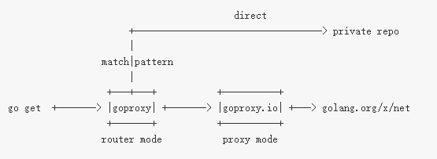
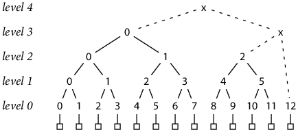
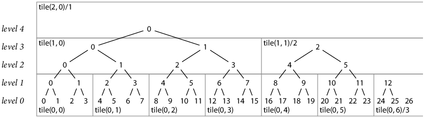
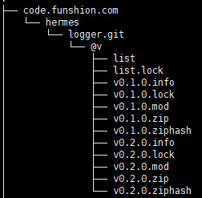
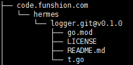
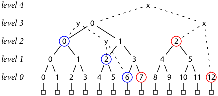

# goproxy与gosumdb搭建

### 客户端配置

发布地址：192.168.6.242

环境变量配置

```
go env -w GOPROXY="http://192.168.6.242"
```

### goproxy服务器配置

#### 流程



搭建自己的go代理服务goproxy，使go get取包时先走goproxy，goproxy对包名进行解析，自己的包走私有的git服务器，其他从上游代理服务器取，所有取到的包都永久存储本地服务器，go get优先返回服务器的文件。

#### 配置service服务管理

service goproxy start|stop|restart

```
#!/bin/bash
#
# /etc/rc.d/init.d/hermes_goproxy
# init script for hermes_goproxy precesses
#
# processname: hermes_goproxy
# description: hermes_goproxy
# chkconfig: 2345 86 16
# description:  Start up the hermes_goproxy servlet engine.
if [ -f /etc/init.d/functions ]; then
        . /etc/init.d/functions
elif [ -f /etc/rc.d/init.d/functions ]; then
        . /etc/rc.d/init.d/functions
else
        echo -e "\hermes_goproxy: unable to locate functions lib. Cannot continue."
        exit -1
fi
 
RETVAL=$?
PID_DIR=/var/run
LOG_DIR=/home/web_log/hermes_goproxy
EXE_DIR=/home/hermes/go-proj/src/goproxy
 
LISTEN_ADDR=192.168.6.242:80
CACHE_DIR=/home/go_repo/
PROXY_ADDR=https://goproxy.io
PRIVATE_DOMAIN=code.funshion.com
# Go env environment variables
export GOINSECURE="$PRIVATE_DOMAIN"
export GONOSUMDB="$PRIVATE_DOMAIN"
export GOPRIVATE="$PRIVATE_DOMAIN"
export GO111MODULE="on"
export GOPROXY=""
export GOSUMDB="off"
export GIT_TERMINAL_PROMPT="0"
export GIT_SSH=""
export GIT_SSH_COMMAND="ssh -o ControlMaster=no"
export PATH=/usr/local/bin:$PATH
echo "Test if private git repo is accessable by mgo"
mgo mod download -json code.funshion.com/hermes/logger@v1.0.1
case "$1" in
start)
        if [ ! -f "${PID_DIR}/hermes_goproxy.pid" ];then
           cd $EXE_DIR
           nohup ./bin/goproxy -listen=$LISTEN_ADDR -cacheDir=$CACHE_DIR -proxy $PROXY_ADDR -exclude "$PRIVATE_DOMAIN" > ${LOG_DIR}/hermes_goproxy.log 2>&1 &
           echo $! > ${PID_DIR}/hermes_goproxy.pid
           echo ${LOG_DIR}/hermes_goproxy.log
        else
          echo "${PID_DIR}/hermes_goproxy.pid exists"
          exit 1
        fi
        ;;
stop)
        kill `cat ${PID_DIR}/hermes_goproxy.pid`
        rm -f ${PID_DIR}/hermes_goproxy.pid
        echo ${LOG_DIR}/hermes_goproxy.log
        ;;
restart)
        $0 stop
        $0 start
        ;;
*)
        echo $"Usage: $0 {start|stop|restart}"
        exit 1
        ;;
esac
exit $RETVAL
```

#### 服务器git SSH免密登录配置

go get 取包实际是git clone，需要配置ssh免密登录（除非gogs服务端允许免登录浏览公有仓库REQUIRE_SIGNIN_VIEW = true）。

1）环境要求：git版本大于1.8（测试环境1.7.1不生效，1.8.3生效。242 git版本2.7.1）。

2）以用户root登陆goproxy所在服务器，并执行ssh-keygen生成id_rsa,和id_rsa.pub,采用默认设置一直按回车

3）在gogs用goproxy需要的git账号登录，将上步生成的 ~/.ssh/id_rsa.pub内容粘贴到SSH Keys配置Content中，Key Name可任意取。

4）配置goproxy所在服务器的git地址强制替换ssh

```
git config --global url."ssh://git@xxx:".insteadOf "https://xxx"
```

*备注：另外两种配置方式为，1）在git服务器端配置goproxy服务器ssh免密登录。2）配置git地址强制转换为带用户的连接。git config --global url."http://账号:密码@xxx:".insteadOf "https://xxx"*

#### 主要命令

./bin/goproxy [-listen 0.0.0.0:8081] [-cacheDir dir] [-proxy host] [-exclude host] [-insecure host]

- -listen 监听端口，默认8081
- -cacheDir 仓库存储路径，默认/home/go_repo/pkg/mod/cache/download
- -proxy 上游代理服务器，公网取包地址，默认[https://goproxy.io](https://goproxy.io/)
- -exclude 排除的取包地址，即内网私有私有库，默认code.funshion.com
- -cacheExpire Go Modules cache expiration (min), for /@v/list request ONLY , default is 5 min

### 附：go的一些环境变量说明

- GOPROXY  例：GOPROXY="http://repo.funshion.com:8081"，在go get获取mod时从指定的代理服务获取
- GONOPROXY  例：GONOPROXY="code.funshion.com"，在获取code.funshion.com开头的mod时不从GOPROXY指定的代理服务获取，支持用逗号分割，可以填写多个值
- GOSUMDB  例：GOSUMDB="sum.golang.org"，go get获取的包的校验地址，默认为sum.golang.org。 当业务项目根目录下go.sum文件中已经存储有某个包的checksum则不再去访问sumdb。
- GONOSUMDB  例：GONOSUMDB="code.funshion.com"，在获取code.funshion.com开头的mod后不进行校验，支持用逗号分割，可以填写多个值
- GOPRIVATE  例：GOPRIVATE="code.funshion.com"，在获取code.funshion.com开头的mod是不从代理服务获取，而是直接从git访问，支持用逗号分割，可以填写多个值
- GOINSECURE  例：GOINSECURE="code.funshion.com"，在获取code.funshion.com开头的mod时可以采用不安全的http连接，支持用逗号分割，可以填写多个值

接口返回示例：

https://goproxy.io/github.com/pochard/logrotator/@latest

```
{"Version":"v1.1.3","Time":"2020-04-11T05:45:55Z"}
```

https://goproxy.io/github.com/pochard/logrotator/@v/list

```
v1.1.0
v1.1.1
v1.1.2
v1.1.3
```

### gosumdb环境搭建

**前因：**私有环境加入了goproxy使得可以go get私有包，但是安全性考虑，决定对私有包也进行一致性校验，保证所有人get的包是完全一致的。

**解决方法：**搭建私有的gosumdb服务

#### 流程

当请求到达gosumdb服务时先判断缓存中（采用redis作为缓存）是否已经存在该请求的包，有就直接返回，否则判断是否是私有包，

- 私有包则从redis数据库查询hash值
- 公共包公网查询hash值，[https://sum.golang.google.cn](https://sum.golang.google.cn/)

最后将结果缓存并响应请求

#### 接口说明

/supported

当go环境配置了代理服务器时，gosum时会先访问"代理地址/sumdb/$GOSUMDB/supported"，当该接口响应为200之后的gosum访问都会走该路径，否则走[http://sum.golang.org](http://sum.golang.org/)

/latest

returns the signed hash of the latest tree.

/tile

reads the content of tile t. It is only invoked for hash tiles (t.L ≥ 0).

/lookup

looks up a record for the given module, 返回mod对应hash值及服务签名

#### 使用说明

```
go env -w GOSUMDB=sum.funshion.com+bf3cf8ea+AcdkkHpghsvTbRciz0ZsG/WSb92wc8S9ttT/0dZ+9LmD
```

#### /lookup 详细说明

返回结构示例

```
310116
golang.org/x/crypto v0.0.0-20191011191535-87dc89f01550 h1:ObdrDkeb4kJdCP557AjRjq69pTHfNouLtWZG7j9rPN8=
golang.org/x/crypto v0.0.0-20191011191535-87dc89f01550/go.mod h1:yigFU9vqHzYiE8UmvKecakEJjdnWj3jj499lnFckfCI=
 
 
go.sum database tree
8464300
lvscesvQc+mvSZKHMwRvNHl1bpHvuS09Y4pH2/cMdo4=
 
— sum.golang.org Az3grqVNIddz2eBWjiAtU7WMr9mctapjal6VNVmE21EAVkdG7vkZICH+ccq7AF4q4VVDTYm2Arx+HqzCb8EOjh9XwAg=
```

第一行：id（int64）递增序列，从0计数，每次不同的请求会+1，即每个不同版本的包会+1，若是相同则会找到上次的id返回

第二行：包对应版本的所有文件的hash值

第三行：包对应版本的go.mod文件hash值

第六行：固定字符串

第七行：服务器端所接收的不同的请求的总数，即所有查询过的包的总数，即id的最大值+1

第八行：根hash值，每次请求会跟第二行第三行进行sha256生成一个hash值，每两个hash值再次进行运算，最后构建成二叉树，该行返回的就是该树的根节点，树的结构见文档https://research.swtch.com/tlog

第十行：服务器端签名，根据第七行第八行以及服务的privatekey生成，takes as input a Note and a list of Signers and returns an encoded, signed message.

##### Generating Keys

golang.org/x/mod/sumdb/note/note.go中的GenerateKey方法。

使用示例

```
// Generating Keys
//
// There is only one key type, Ed25519 with algorithm identifier 1.
// New key types may be introduced in the future as needed,
// although doing so will require deploying the new algorithms to all clients
// before starting to depend on them for signatures.
//
// The GenerateKey function generates and returns a new signer
// and corresponding verifier. 
 
package main
import ( 
    "crypto/rand" 
    "fmt" 
    "golang.org/x/mod/sumdb/note"
)
func main() { 
    skey, vkey, err := note.GenerateKey(rand.Reader, "sum.funshion.com") 
    if err != nil {
        panic(err) 
    } 
    fmt.Println("私有秘钥: "+skey) 
    fmt.Println("公有秘钥: "+vkey)
}
```

#### /latest 详细说明

```
go.sum database tree
8464300
lvscesvQc+mvSZKHMwRvNHl1bpHvuS09Y4pH2/cMdo4=
 
— sum.golang.org Az3grqVNIddz2eBWjiAtU7WMr9mctapjal6VNVmE21EAVkdG7vkZICH+ccq7AF4q4VVDTYm2Arx+HqzCb8EOjh9XwAg=
 
```

与lookup的第6、7、8、9、10行相同

#### /tile 详细说明

A Tile is a description of a transparency log tile. A tile of height H at level L offset N lists W consecutive hashes at level H*L of the tree starting at offset N*(2* *H). A complete tile lists 2H hashes; a partial tile lists fewer. Note that a tile represents the entire subtree of height H with those hashes as the leaves. The levels above H*L can be reconstructed by hashing the leaves. Each Tile can be encoded as a “tile coordinate path” of the form tile/H/L/NNN[.p/W]. The .p/W suffix is present only for partial tiles, meaning W < 2**H. The NNN element is an encoding of N into 3-digit path elements. All but the last path element begins with an "x". For example, Tile{H: 3, L: 4, N: 1234067, W: 1}'s path is tile/3/4/x001/x234/067.p/1, and Tile{H: 3, L: 4, N: 1234067, W: 8}'s path is tile/3/4/x001/x234/067. See Tile's Path method and the ParseTilePath function. The special level L=-1 holds raw record data instead of hashes. In this case, the level encodes into a tile path as the path element "data" instead of "-1". See also https://golang.org/design/25530-sumdb#checksum-database and https://research.swtch.com/tlog#tiling_a_log.

##### 服务器端hash结构树



level0对应的hash就是每次请求的包的hash的两行记录进行sha256运算得到的32位hash，之后如图两两sha256得到根hash

服务器端采用list储存hash结构树，其中实线部分是已经存在list中，虚线部分节点并不存在，如图所示，要计算这个树的根hash需要先得到 (3,0) (2,2) (0,12)

list与树对应关系，

- list[0] – h(0,0)
- list[1] – h(0,1)
- list[2] – h(1,0)
- list[3] – h(0,2)
- list[4] – h(0,3)
- list[5] – h(1,1)
- list[6] – h(2,0)
- list[7] – h(0,4)
- ...

##### tile结构详解

引入tile结构目的：不仅可以将哈希存储减半，又可以使网络流量更加缓存友好，只需稍微增加实现复杂性



tile结构是对二叉树进行分片，如图将这棵树分成了高度为2的块。

为了减少储存，仅保存每一块的最下面一行，可以使储存优化近50%，当然增加了io。

```
type Tile struct {
    H int   // 树的高度 (1 ≤ H ≤ 30)
    L int   // 树的横坐标 (-1 ≤ L ≤ 63)
    N int64 // 树的纵坐标 (0 ≤ N, unbounded)
    W int   // 如果该块不是满二叉树的，该值表示最下层的数量 (1 ≤ W ≤ 2**H; 2**H is complete tile)
}
```

hash树节点与tile对应关系举例，这里如图高度为2进行示例

- h(0,6) – Tile{2,0,1,3}
- h(0,0) – Tile{2,0,0,1}
- h(3,0) – Tile{2,1,0,2}
- h(1,12) – Tile{2,0,6,2}
- ...

/tile接口返回值说明

如传参为Tile{2,0,6,2}，将会返回高度为2，坐标为(0,6)的tile块的最下层的前两个hash值

### ~~包的发布~~

#### ~~使用说明~~

~~http://repo.funshion.com:8081/publish?mod=模块名@版本号~~

#### ~~示例~~

~~http://[repo.funshion.com](http://192.168.6.163:8081/publish?mod=):8081/publish?mod=[code.funshion.com/hermes/logger@v0.2.0](http://code.funshion.com/hermes/logger.git@v0.2.0)~~

#### ~~服务端流程~~

1. ~~验证参数格式，不合法报错{"code": 1001, "errmsg": 具体错误信息}~~
2. ~~查询redis库，如果包的tag已经存在，则报错{"code": 1002, "errmsg": "version exists"}，若查询redis报错则报错{"code": 1003, "errmsg": 具体错误信息}~~
3. ~~通过go mod download将包下载至服务器，若出错则报错{"code": 1004, "errmsg": "fail to get go mod: " + 具体错误信息}~~
4. ~~go mod download会计算其hash值，将得到的hash写入redis库，若出错则报错{"code": 1005, "errmsg": "fail to write to redis: " + 具体错误信息}~~
5. ~~成功返回{"code": 0}~~

~~该服务最终结果是将包及对应版本的hash写入redis数据库，供sumdb验证时查询使用。~~

### go mod download大致流程

#### 文件预览



#### 流程

1. 验证包及其版本号是否合法，生成对应并将版本号写入 list 文件
2. 从对应的git仓库获取源代码
3. 获取对应的info信息（主要包含版本号及时间）并写入对应 版本号.info 文件
4. 将源代码中的go.mod文件拷贝至此目录并重命名 版本号.mod
5. 将源代码打包为对应的 版本号.zip 文件，此过程不会打包 .git 文件夹。zip文件目录见下图
6. 计算zip的hash值并写入 版本号.ziphash文件。该过程计算的是zip中的每个文件，计算hash值（计算规则如下：gosum校验规则）时用到的文件名为相对性zip包的绝对路径。如文件名 code.funshion.com/hermes/logger.git@v0.1.0/t.go
7. 判断该包是否需要gosumdb验证

- - 不需要验证直接结束
	- 需要验证的话验证通过即结束，否则报错

版本号.lock文件用于作为锁。多个go mod download同时执行同一个包及版本中，当一个进程打开这个文件时，其他进程应等待

zip文件结构



即会将目录重命名指定形式

 

### go mod 验证大致流程

#### 流程

1. 判断该包是够需要验证
2. 访问sumdb的/lookup接口，后接包名@版本，例：/lookup/github.com/go-redis/redis@v6.15.9
3. 拿到返回值后先校验database tree部分，通过之后将database tree储存到本地
4. 之后校验有关包的部分，先拿到id值去服务器获取包含id节点在内能计算得到根hash的所有节点值（通过/tile接口），计算根hash与本地储存的database tree是否一致
5. 从服务器拿到的所有的hash值中解析id所对应的hash值
6. 计算第二步拿到的第二三行的hash值是否与第五步一致
7. 将其中访问的/looup以及/tile接口的值缓存到本地

##### 第三步校验database tree详细说明



如图，假设本地上次请求时服务器仅有7条记录，那么本地的根hash就是y节点。第二次请求时服务器记录变成了13条，那么此时根hash就变成了x节点

此步骤就是验证y与x是否是同一颗树生成的。

y = H(h(2, 0), H(h(1, 2), h(0, 6)))

x = H(h(3, 0), H(h(2, 2), h(0, 12))) = H(H(h(2, 0), H(h(1, 2), H(h(0, 6), h(0, 7)) ))), H(h(2, 2), h(0, 12)))

那个就需要得到[h(2, 0), h(1, 2), h(0, 6), h(0, 7), h(2, 2), h(0, 12)]节点的hash值就可以计算出x与y并可以检查它们是否与原始值匹配

如何将节点转化为Tile并发送tile请求见上 /tile 详细说明

 

### go list 命令的用法

```
go list [-f format] [-json] [-m] [list flags] [build flags] [packages]
```

具体使用方法参见https://pkg.go.dev/cmd/go#hdr-List_packages_or_modules

需要注意的点

- go list 命令必须在包含go文件的目录中执行
- 当使用-m参数时列出的是模块而不是包，所以必须在包含go.mod文件的文件夹下执行
- 当使用-m时，会先访问主模块的所有依赖，即go.mod中所引用的，之后才会根据参数去访问指定模块，所有必须保证主模块的依赖可以访问的到。

 

### gosum校验规则

正常情况下，每个依赖包版本会包含两条记录，第一条记录为该依赖包版本整体（所有文件）的哈希值，第二条记录仅表示该依赖包版本中go.mod文件的哈希值，如果该依赖包版本没有go.mod文件，则只有第一条记录。

依赖包版本中任何一个文件（包括go.mod）改动，都会改变其整体哈希值，此处再额外记录依赖包版本的go.mod文件主要用于计算依赖树时不必下载完整的依赖包版本，只根据go.mod即可计算依赖树。

每条记录中的哈希值前均有一个表示哈希算法的h1:，表示后面的哈希值是由算法SHA-256计算出来的，目前go只有这一个算法。

#### hash计算方法

1. 将所有要计算的文件的文件名字符串按递增顺序对其进行排序
2. 依次读取文件的内容并分别进行SHA-256计算
3. 按顺序并按照【哈希值 (此处两个空格)文件名\n】规则进行拼接
4. 将第三步得到的结果再进行SHA-256计算
5. 最后结果按照RFC 4648 中定义的 base64 编码并添加 "h1:"前缀

#### 核心代码

```
func Hash1(files []string, open func(string) (io.ReadCloser, error)) (string, error) {
    h := sha256.New()
    files = append([]string(nil), files...)
    sort.Strings(files)
    for _, file := range files {
        if strings.Contains(file, "\n") {
            return "", errors.New("dirhash: filenames with newlines are not supported")
        }
        r, err := open(file)
        if err != nil {
            return "", err
        }
        hf := sha256.New()
        _, err = io.Copy(hf, r)
        r.Close()
        if err != nil {
            return "", err
        }
        fmt.Fprintf(h, "%x  %s\n", hf.Sum(nil), file)
    }
    return "h1:" + base64.StdEncoding.EncodeToString(h.Sum(nil)), nil
}
```

#### 单文件示例

[go.mod](http://confluence.funshion.com:8090/download/attachments/23233102/go.mod?version=1&modificationDate=1639550445000&api=v2)  ==>   h1:I3AJXr54wJ2GdCx1mBrKp3rl1o0kY3UAkvKuzvkSpWA=

```
package main
 
import (
    "bytes"
    "crypto/sha256"
    "encoding/base64"
    "errors"
    "fmt"
    "io"
    "io/ioutil"
    "sort"
    "strings"
)
 
func main() {
    data, err := ioutil.ReadFile("go.mod")
    if err != nil {
        panic(err)
    }
    res, err := Hash1([]string{"go.mod"}, func(string) (io.ReadCloser, error) {
        return ioutil.NopCloser(bytes.NewReader(data)), nil
    })
    if err != nil {
        panic(err)
    }
    fmt.Println(res)
}
 
func Hash1(files []string, open func(string) (io.ReadCloser, error)) (string, error) {
    h := sha256.New()
    files = append([]string(nil), files...)
    sort.Strings(files)
    for _, file := range files {
        if strings.Contains(file, "\n") {
            return "", errors.New("dirhash: filenames with newlines are not supported")
        }
        r, err := open(file)
        if err != nil {
            return "", err
        }
        hf := sha256.New()
        _, err = io.Copy(hf, r)
        r.Close()
        if err != nil {
            return "", err
        }
        fmt.Fprintf(h, "%x  %s\n", hf.Sum(nil), file)
    }
    return "h1:" + base64.StdEncoding.EncodeToString(h.Sum(nil)), nil
}
```

#### 压缩包示例

[gotest.zip](http://confluence.funshion.com:8090/download/attachments/23233102/gotest.zip?version=1&modificationDate=1639550652000&api=v2)   ==>   h1:8n/cZHV3BWCTaNYklCIEfSwBgfXIsMwFpyebyusdZHE=

```
package main
 
import (
    "archive/zip"
    "crypto/sha256"
    "encoding/base64"
    "errors"
    "fmt"
    "io"
    "sort"
    "strings"
)
 
func main() {
    z, err := zip.OpenReader("gotest.zip")
    if err != nil {
        panic(err)
    }
    defer z.Close()
    var files []string
    zfiles := make(map[string]*zip.File)
    for _, file := range z.File {
        files = append(files, file.Name)
        zfiles[file.Name] = file
    }
    zipOpen := func(name string) (io.ReadCloser, error) {
        f := zfiles[name]
        if f == nil {
            return nil, fmt.Errorf("file %q not found in zip", name) // should never happen
        }
        return f.Open()
    }
    res, err := Hash1(files, zipOpen)
    if err != nil {
        panic(err)
    }
    fmt.Println(res)
}
 
func Hash1(files []string, open func(string) (io.ReadCloser, error)) (string, error) {
    h := sha256.New()
    files = append([]string(nil), files...)
    sort.Strings(files)
    for _, file := range files {
        if strings.Contains(file, "\n") {
            return "", errors.New("dirhash: filenames with newlines are not supported")
        }
        r, err := open(file)
        if err != nil {
            return "", err
        }
        hf := sha256.New()
        _, err = io.Copy(hf, r)
        r.Close()
        if err != nil {
            return "", err
        }
        fmt.Fprintf(h, "%x  %s\n", hf.Sum(nil), file)
    }
    return "h1:" + base64.StdEncoding.EncodeToString(h.Sum(nil)), nil
}
```

 

### 参考文档

https://research.swtch.com/tlog

https://datatracker.ietf.org/doc/html/rfc6962#section-2.1

https://pkg.go.dev/cmd/go#hdr-List_packages_or_modules

https://proxy.golang.org/